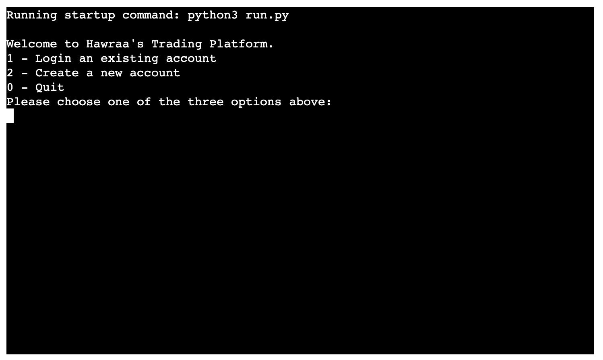

# Hawraa's Trading Platform 
Hawraa's Trading Platform is a digital interface or software system that enables users to buy, sell, and manage financial assets such as stocks.

The platform is typically designed to facilitate a range of investment activities for individuals, financial advisors, or institutional investors.

In my project, which runs in the Code Institute mock terminal on Heroku, the platform enables users to interactively manage a stock portfolio, simulating trading activities like buying, selling, depositing, and withdrawing funds, all while maintaining an up-to-date portfolio value.

In this Portfolio-Project, the Platform offers tools to manage and track the investment, showing gains, losses, and asset allocation.

Here is the live version of my project.

## How to start investing on the platform?

The base of the platform is a digital investment portfolio management system that allows users to manage stock holdings and cash investments interactively. The yfinance library is a powerful tool that allows the user to access stock market data for a variety of companies in real time, making it useful for tracking and trading stocks. 

Yfinance provides up-to-date information on stock prices. In this setup, the user use Yfinance to get stock price data for buying and selling stocks in his portfolio.

First, the user choose one of 2 options: create a portfolio or log in his portfolio. When he chooses the first option, he has an id number and password and the program check if the selection is valid. When he choose the second option, he create a portfolio and the program give him an id and password. Next, when the portfolio is created, the user has a liberty to enter an initial investment amount that will act as starting buying power. This is the cash available to make his first stock purchases and he start the investemnt by choosing the different option he has: buying, selling the stocks, increasing or withdrawing the funds.

The platform offers more options for the user to choose what and how he wants to invest.

## Features

### Existing Features

- Initial Investment Setup:
  - The user starts by logging in his portfolio or creating one if he has not. 
  - Next, he enters an initial investment amount and a password in case he chose to create a new account.
  - Then, he has more options to invest in his portfolio.

- Option 1 : Buying Stocks

  - The user purchases stocks by specifying a stock symbol and the number of stocks he wants to buy.
  - The platform checks if the user has enough buying power to complete the purchase. If they do, it adds the stocks to the portfolio and deducts the cost from their buying power.

- Option 2: Selling Stocks

  - The user can sell stocks he owns by specifying the symbol and quantity.
  - The platform checks if the user owns enough stocks to sell the requested amount. If so, it sells the shares, adds the sale proceeds to the buying power, and updates the stock quantity.

- Stock Symbol Verification

  - When buying or selling stocks, the platform checks if the entered stock symbol is valid by consulting a list of stock symbols from an external data source. We note that the complete set of stock symbols are stored in the file stock_list.txt

- Option 3: Increasing Investment

  - Users can increase the cash in their portfolio by adding more funds to their initial investment and available buying power. The condition to increase the investment is that the number needs to be greater than zero.

- Option 4: Withdrawing Funds

  - Users can withdraw money from their available buying power. The platform ensures that the user has enough funds to cover the withdrawal. Also here, the condition to withdraw funds is the positive value of the number which the user wants to withdraw.

- Account Status Check:

  - Users can check their portfolio's current status, which includes:
    - Buying Power: The cash available to buy more stocks.
    - Account Value: The total value of the portfolio, including both cash and stocks (using current stock prices from the yfinance library).
    - Investment: The initial invested amount plus any additional funds added.
    - Stock Holdings: A list of the stocks in the portfolio, including symbols and quantities.

- The investor can clearly determine the profit or loss:

  - If the account value exceeds the investment by x, the profit is x.

  - If the investment exceeds the account value by y, the loss is y.
### Future Features

- Allow users to collaborate on investments, share insights, and collectively analyze market trends.

- Allow users to test their algorithms against historical data to evaluate potential performance.

- Allow users to control over data storage using decentralized systems to enhance privacy and security.

## Portfolio Model

At the heart of the platform lies the Portfolio class, which acts as the core model for managing each user's investment activity. This class was chosen to encapsulate all essential elements of a user's financial profile within the system, enabling real-time tracking, management, and decision-making. By centralizing the portfolio logic in a dedicated class, the platform ensures a clean, scalable, and organized architecture.

The Portfolio class is designed to:

- Track a user's investment progress over time.

- Maintain accurate financial records including cash balance and stock holdings.

- Support dynamic interactions, such as buying, selling, and updating investment data.

- Help users make informed decisions through real-time updates and accessible metrics.

Also, the Portfolio class is packed with intuitive methods that allow users to interactively manage their investments:

- print( ): Outputs the current state of the portfolio including stock holdings, cash balance, and account value.

- input( ): captures and validates user input for actions such as buying or selling stocks.

- clear_terminal( ): clears the console screen for a cleaner user interface experience.

- get_stock_price(ticker): fetches the latest stock price for the specified ticker symbol using the yfinance API.

- get_symbol_list( ): returns a list of available or commonly traded stock ticker symbols for user reference.

- assign_id( ): automatically generates a unique ID for new users when creating a portfolio.

- load_portfolio(id, password): retrieves and loads an existing portfolio from storage based on the user’s credentials.

- save_update( ): saves changes to the user's portfolio after any transaction or update, ensuring persistence.

- buy_stock(ticker, quantity): executes a buy order if the user has enough funds, updates the owned stocks and deducts the cost from buying power.

- sell_stock(ticker, quantity): processes a sell order, removes the appropriate quantity of shares, and credits the sale proceeds to the user's cash balance.

- update_account_value( ): recalculates the total portfolio value based on the latest stock prices and cash available.

- increase_investment(amount): allows users to add more funds to their account, increasing their buying power.

- withdraw_funds(amount): enables users to withdraw money from their portfolio if sufficient funds are available.

## Testing
- Tested in my local terminal and the Code Institute Heroku terminal.
### Code Validation 
#### Google lighthouse Validation

To ensure that the platform’s frontend performs optimally, we used Google Lighthouse—an open-source, automated tool for improving the quality of web pages. The tool provides insights into various performance metrics, accessibility, best practices, and SEO.

Testing was conducted in private browsing mode to eliminate any cached data or session interference, ensuring accurate results.

Lighthouse Testing Process:

- Open the platform in Google Chrome.

- Open the DevTools panel (F12 or Ctrl + Shift + I).

- Go to the Lighthouse tab.

- Run the audit with the settings set to Performance, Accessibility, Best Practices, and SEO.

- Analyze the generated report.

Key Metrics Tested:

- Performance: Measures how quickly the page loads and becomes interactive.

- Accessibility: Assesses whether the platform is accessible to all users, including those with disabilities.

- Best Practices: Checks for security and code quality issues.

- SEO: Ensures the platform is search engine-friendly.

Results:

- The platform scored high in Performance (with a focus on time to interactive and load speed).

- Accessibility issues were minimal, with recommendations for improving text contrast and ensuring ARIA labels are correctly used.

- Best practices were followed, with no major issues.

- SEO scores were also good, ensuring the platform's content is discoverable by search engines.

#### PEP8 Code Institute Python Linter Validation

To maintain high-quality, readable, and standardized Python code, the platform's Python files were validated using the PEP8 Python style guide via the Code Institute Python Linter.[PEP8](https://pep8ci.herokuapp.com/) validator.

PEP8 Validation Process:

- The Python code was passed through the Code Institute’s PEP8 linter: PEP8 Linter.

- The linter analyzed the code for style violations and potential errors based on the official PEP8 guidelines.

- Any issues, such as indentation problems, line length, or improper naming conventions, were corrected.

Key Checks:

- Indentation: Ensured consistent use of spaces (4 spaces per indentation level).

- Line Length: Verified no lines exceed the 79-character limit, as recommended by PEP8.

- Whitespace: Checked for proper whitespace usage around operators, commas, and functions.

- Naming Conventions: Ensured variable and function names follow the snake_case style.

Results:

- The code passed all PEP8 style checks with no significant issues.

### Bugs

#### Solved Bugs

- The program did not work initially when the input by a user was invalid and errors were returned regarding the inconsistent format. I solved the problem by handling the error using *if-else* conditioning and *try-except* approach to return error messages for the user in case of invalid entries.

- The user had to press the enter key when requested to push any key to continue. Now this is solved using the *getch* function instead of the *input* function.

- Getting the current stock price and the list of available stocks was done initially using the [Alpha Vantage](https://www.alphavantage.co/) API. However the access there is limited in the free edition to 25 requests per day which is quite restrictive since an error directly appears after 25 requests asking me to buy the premium edition for a quasi-continuous number of requests. I found then an alternative solution by using the yahoo finance API to get the current price of a stock. Although unlike the case when using the Alpha Vantage API, the price is not a real-time price since it has a delay of up to 15 minutes but it is free and sufficient to use in my Portfolio project. As for the list of current stocks symbols in the market I got them from wikipedia and saved them in the file *"stock_list.txt"*.

- The Heroku application crushed when I tried to use the Heroku's API in order to edit the creds.json file stored in it. And the performance was not reliable, so I had to switch to Github's API that allows the access and editing of the creds.json file stored as a Gist in my Github's account.

### Remaining Bugs

- No bugs remaining

## Deployment

This project was deployed using Code Institute's mock terminal for Heroku.

- Steps for deployment: 

   - Fork or clone this repository 
   - Create a new Heroku app
   - Set the buildbacks to *Python* and *NodeJS* in that order
   - Link the Heroku app to the repository
   - Create a *CREDS_GITHUB* variable that stores the API key to access the *creds.json* file stored as a Gist in the Github account hosting the project. This is essential in order to limit the access only to the administrator who is managing the accounts on *Hawraa's trading platform*.
   - Click on Deploy Branch

   

## Content and tools used

- Yahoo finance library (yfinance) for getting real-time prices of stocks.
- Wikipedia for getting the list of symbols for all the stocks.
- Github Gist to store all Users portfolios. We access the data stored in the Gist through an API using a GIST_ID stored as a configuation variable in Heroku and locally in an env.py file together with the GITHUB_TOKEN. In case two Portfolios are stored in the Gist, the file stored therein has the following json format:

[{"stock": {"AAPL": 10.0, "BRK-B": 1.0, "NVR": 2.0, "VST": 9.0, "AMD": 5.0, "UBER": 10.0, "MSTR": 3.0, "NVDA": 4.0, "AIT": 10.0, "AVGO": 40.0}, "investment": 47000.0, "account_value": 40713.67998504639, "buying_power": 13734.830032348633, "password": "lolo", "id": 1, "creds": "creds.json"}, {"stock": {"AVGO": 1.0, "LLY": 2.0}, "investment": 3000.0, "account_value": 3000.0, "buying_power": 1342.7599792480469, "password": "bobo", "id": 2, "creds": "creds.json"}]

## Running the code from Github
🚀 How to Run This Project
Follow these steps to get the project running locally:

1️⃣ Clone the Repository
First, clone the repository from GitHub to your local machine:

git clone https://github.com/your-username/your-repo-name.git
cd your-repo-name

2️⃣ Create a Virtual Environment & Install Requirements
It's recommended to use a virtual environment:

python3 -m venv .venv       # or 'python -m venv .venv' depending on your setup
source .venv/bin/activate   # On Windows use: .venv\Scripts\activate
Then install the required packages:

pip install -r requirements.txt
3️⃣ Set Up Environment Variables
Create a file named env.py in the root directory of the project and add the following content:

GIST_ID = "your_gist_id_here"
GITHUB_TOKEN = "your_github_token_here"
🛡️ Make sure not to commit env.py to version control if it contains sensitive data.

4️⃣ Run the Application
Finally, run the Python script:

python3 run.py     # for macOS/Linux
or

python run.py      # for Windows

## Credits

Would like to say thanks to all for the support throughout the project.

- [Code Institute](https://codeinstitute.net/global/) for all the support and knowledge.
- [Slack community](https://slack.com/intl/en-ie/) tech-humour channel where I got the inspiration for this project and some feedback. My cohort channel for all the support and feedback.
- My mentor Diego Pupato who's continuously very supportive of me and very knowledgeable.
- I would also like to thank or say sorry to my family. I'm not too sure they have seen me much these past weeks.

